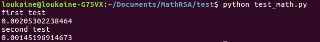
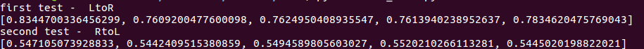

% Programmation linéaire
% Segalen Philippe
% 28 juin 2017

# Exponentiation modulaire

## LtoR dichotomic exponentiation

~~~
def modexp_lr(a, b, m):
    r = 1
    for bit in reversed(_bits_of_n(b)):
        r = r * r % m
        if bit == 1:
            r = r * a % m
    return r

~~~

## Fonction bits_of_n

~~~
def _bits_of_n(m):
  
    bits = []

    while m:
        bits.append(m % 2)
        m /= 2

    return bits
~~~

## RtoL dichotomic exponentiation

~~~
def modexp_rl(a, b, m):
    r = 1
    while 1:
        if b % 2 == 1:
            r = r * a % m
        b /= 2
        if b == 0:
            break
        a = a * a % m

    return r
~~~

## Tests

